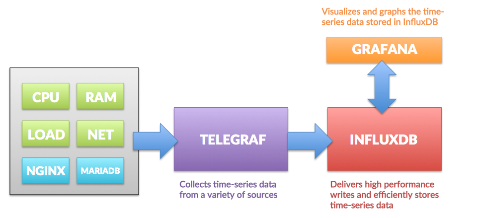

# grafana-influxdb
Contains steps and configuration to setup Grafana Stack for Production Monitoring

Setup Grafana and influxdb

########### Steps for Grafana ##############  
1> wget https://s3-us-west-2.amazonaws.com/grafana-releases/release/grafana-4.3.2.linux-x64.tar.gz 
2> tar -xzf grafana-4.3.2.linux-x64.tar.gz 
3> cd grafana-4.3.2 
4> bin/grafana-server 
 

########### Steps for InfluxDb ############### 
1> wget https://dl.influxdata.com/influxdb/releases/influxdb-1.2.4_linux_amd64.tar.gz 
2> tar -xzf influxdb-1.2.4_linux_amd64.tar.gz 
3> cd influxdb-1.2.4-1/ 

########### Installing Telegraf(collector) ##############  
<i>Install using rpm</i>
&nbsp;<a href="https://repos.influxdata.com/centos/7Server/amd64/stable/">https://repos.influxdata.com/centos/7Server/amd64/stable/ (Influx and telegraf Rpm repo)</a> 

<i>Install using debian</i> 
1> wget https://dl.influxdata.com/telegraf/releases/telegraf_1.0.0_amd64.deb 
2> sudo dpkg -i telegraf_1.0.0_amd64.deb 
